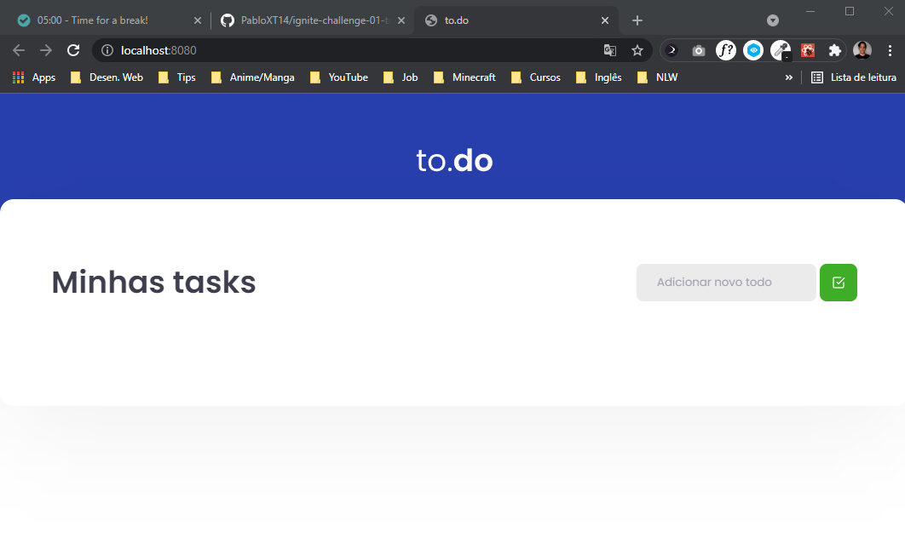

# Todo List Project
Esta é uma aplicação ReactJS desenvolvida para o gerenciamente de tarefas/afazeres do dia a dia, sendo um projeto desenvolvido como Desafio do curso Ignite ReactJS da Rocketseat.

## 📷 Demonstration

## 🚀 Technologies
✔ HTML
 
✔ SCSS (library Sass for CSS)
 
✔ JavaScript
  
✔ TypeScript
 
✔ ReactJS
 
✔ Library Babel
 
✔ Library Webpack
 
✔ IDE: VS Code

## ⚙ Settings
* Para executar o projeto você deve baixar os arquivos ou dar um `git clone` do repositório.
* Após baixar rode o comando `yarn` no terminal dentro do diretório do projeto para baixar todas as dependências.
* Depois de baixar as dependências você tem duas opções de execução do projeto pelo terminal:
    - `yarn dev` (executa a aplicação em modo de desenvolvimento), veja em qual porta o projeto é aberto para executar no seu browser, geralmente é _http://localhost:8080_
    - `yarn build` (executa a aplicação em modo de produção), após executar este comando você terá/poderá executar o arquivo `index.html` da pasta `dist` no seu browser.  

* Obs: a página não está responsiva, o conteúdo só está adaptável para PC/Computador. 
